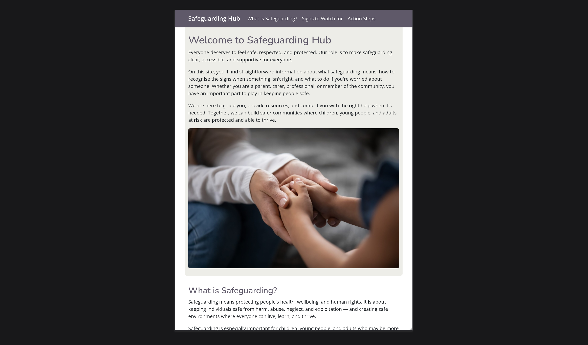
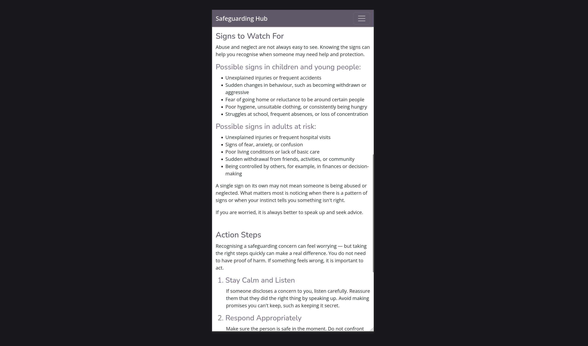

# Application Purpose and user value
A one page website demonstrate an understanding of HTML and CSS principles.

Introduces users to safeguarding principles, how to spot the signs and how to act on concerns.

# Application contents overview

## The website renders responsively depending on screen size

Here the navbar has burger menu containing the site links and all website content is stacked vertically.

On screens sizes medium and above the navbar has expanded to show the contents now along the bar.

XL and XXL screen sizes now have the header image side by side with the text instead of stacked.

## The navbar menu

The navbar options take the user to the specific headings on the page without covering them.

## Other user centric design elements

- Use of colour and weights to differentiate headings and subheadings
- A font choice that felt professional but welcoming
- For most screen sizes the navbar elements have padding to make them more central and alined with the page content.

# Deployment procedure
Github pages automatically redploys site updates upon pushes to the remte repository.

# AI usage
I mainly used AI to generate website name suggestions and produce the text to populate the website sections. Additionally I had it generate some of the HTML paragraph structure for the text it generated. It did somewhat help but added unneccesary tags I then had to remove.

I did not use to it fix or optimise any code for this project, because I did not feel the need to for this particular project.

# Citations
- Favicon is [moniruldislam's S icon](https://www.freepik.com/icon/letter-s_9083014#fromView=resource_detail&position=7)
- Hand holding image copied from [North East London's page on safeguarding](https://northeastlondon.icb.nhs.uk/about-us/about-nhs-north-east-london/our-statutory-duties/safeguarding/what-is-safeguarding/)